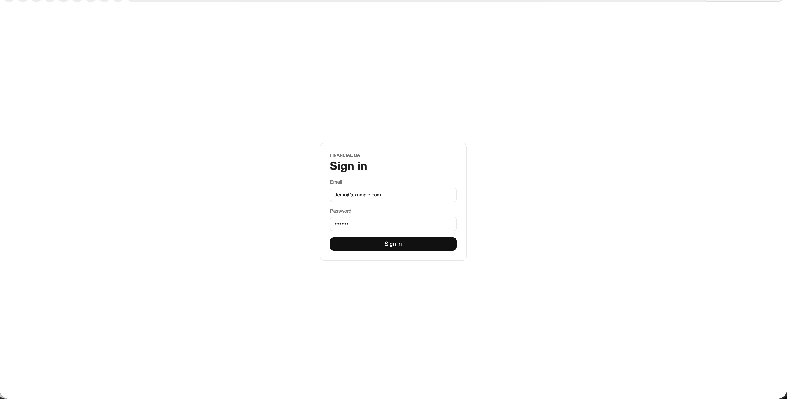
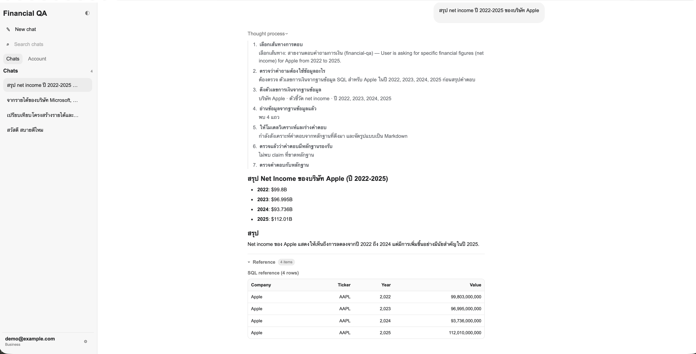
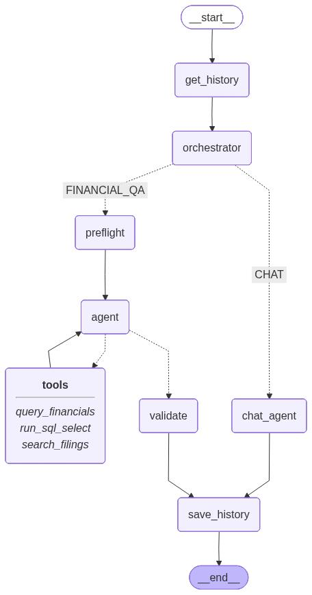

# Financial QA Chatbot

Local grounded Q&A app It combines a FastAPI/LangGraph backend, PostgreSQL financial data, Pinecone Local 10-K retrieval, JWT sign-in, and a Next.js chat UI.

## Requirements Covered

- Signed-in users can ask financial questions through the web UI.
- Structured figures come from PostgreSQL `financial_data`.
- Qualitative strategy/business answers come from the FY2025 10-K vector index.
- Missing data is surfaced explicitly. Microsoft has SQL rows but no 10-K filing, so the app can report Microsoft revenue growth but must not invent Microsoft qualitative factors.
- Docker Compose runs Postgres, Pinecone Local, backend, and frontend locally.

## Setup

1. Copy the environment file and set the OpenAI-compatible keys:

   ```bash
   cp .env.example .env
   ```

   Fill `API_KEY` and `EMBEDDING_API_KEY`. The vector fixture was embedded with `text-embedding-3-small` at `EMBEDDING_DIM=512`; keep that dimension.

2. Build, bootstrap data, and run the full stack:

   ```bash
   docker compose up --build -d
   ```

   This single command starts PostgreSQL, Pinecone Local, the FastAPI backend, and the Next.js
   frontend. During backend startup, Docker Compose runs:

   ```bash
   python scripts/load_sql.py
   python scripts/load_vectors.py
   ```

   After both loaders finish, the backend starts uvicorn. This means the provided SQL and vector
   fixtures are available without running a separate loader container.

   Expected checks:

   - `financial_data`: 192 rows
   - Pinecone `tenk-filings`: 4072 vectors in namespace `__default__`

3. Open the UI:

   - Frontend: <http://localhost:3000>
   - Backend health: <http://localhost:8000/api/v1/health>

Demo credentials default to `demo@example.com` / `demo1234` unless changed in `.env`.

### Optional Data Commands

The one-command startup above is the normal run path. Use these commands only when you want to
manually reload fixtures or rebuild vectors.

Reload the provided SQL and vector fixtures:

```bash
docker compose run --rm backend python scripts/load_sql.py
docker compose run --rm backend python scripts/load_vectors.py
```

To rebuild vectors from the source PDFs instead of using the provided vector fixture:

```bash
docker compose run --rm backend python scripts/reembed_vectors_from_pdfs.py --dry-run
```

```bash
docker compose run --rm \
 backend python scripts/reembed_vectors_from_pdfs.py \
 --output-jsonl /app/data/pinecone_vectors.jsonl
```

The re-embedding script reads `data/10k_filings/*.pdf`, chunks pages with `chunk_size=1000` and
`chunk_overlap=200`, embeds with the configured `EMBEDDING_*` model/dimension, preserves the
fixture-style metadata keys, clears the configured Pinecone namespace by default, and then upserts
the regenerated vectors. Use `--append` to keep existing vectors or `--output-jsonl <path>` to write
the regenerated records as JSONL while importing. The fixture contains two vector records per unique
`(page, text)` chunk, so this script defaults to `--replicas-per-chunk 1` and produces 2036 unique
chunks.

## Web UI

The frontend is a ChatGPT-style chat app served at <http://localhost:3000>. Sign in, then ask
financial questions in Thai or English and watch the agent's reasoning, answer, and evidence stream
in live.

### Sign in



A JWT-protected sign-in screen gates the chat. The demo user is pre-seeded from `.env`
(`DEMO_USER_EMAIL` / `DEMO_USER_PASSWORD`, default `demo@example.com` / `demo1234`). Submitting the
form calls `POST /api/v1/auth/login`, and the returned bearer token authorizes every streaming chat
request.

### Chat workspace



After signing in you land in the main workspace:

- **Left rail** — a "New chat" button, chat search, `Chats` / `Account` tabs, and the browser-local
  list of past chat sections. The signed-in account shows at the bottom.
- **Conversation** — your question appears on the right; the assistant's Markdown answer renders
  below it (headings, bullets, and a Thai summary that mirrors the question language).
- **Thought process** — a collapsible, step-by-step timeline of the agent's reasoning with
  human-readable labels. The first step is the **orchestrator's routing decision**; in this
  screenshot it picks `financial-qa` because the user asked for specific Apple net-income figures.
  The remaining steps show preflight source selection, SQL retrieval, grounding validation, and
  answer drafting.
- **Reference** — an expandable evidence panel under the answer. SQL evidence renders as a table
  (company, ticker, year, value); 10-K evidence renders as expandable citation cards.

The screenshot shows the first baseline question ("สรุป net income ปี 2022-2025 ของบริษัท Apple"):
the orchestrator routes to financial-qa, the agent queries `financial_data`, and the answer reports
Apple's net income for FY2022-FY2025 ($99.8B, $96.995B, $93.736B, $112.01B) with the exact SQL rows
shown as grounded references.

## Baseline Questions

Use these prompts to verify the required behavior:

- Q1: Apple net income for 2022-2025.
- Q2: Google vs Facebook 2025 revenue structure and business strategy.
- Q3: Microsoft, Apple, Google, and Facebook revenue growth from 2024 to 2025, plus grounded factors where filings exist.

Expected behavior for Q3: the answer should identify Meta/Facebook as the highest growth company from SQL, cite available factors for companies with 10-K evidence, and clearly state that Microsoft has no 10-K filing available in the provided vector data.

## Agent Workflow



The workflow image above is generated from the compiled LangGraph definition in
`backend/src/financial_qa/app/agent/graph.py`. Do not edit `backend/assets/workflow.jpeg` or
`backend/assets/workflow.mmd` by hand; regenerate them with:

```bash
cd backend
PYTHONPATH=src python -m financial_qa.app.agent.graph
```

An `orchestrator` node sits right after history loading and routes each turn down one of two
branches that rejoin at `save_history`:

- **`FINANCIAL_QA`** — the grounded retrieval flow (`preflight -> agent -> tools? -> agent ->
  validate`). Used when answering needs data that must be retrieved: company financial figures from
  PostgreSQL or qualitative 10-K content from the vector index.
- **`CHAT`** — a single `chat_agent` node with **no tools**. Used for general conversation and for
  questions answerable from the conversation history or the user's message alone (greetings,
  capability/how-to questions, "summarize what we discussed", "say that again in English").

The graph executes one request as follows:

1. `__start__ -> get_history`: LangGraph starts the run and loads stored conversation history for
   the signed-in user. Conversation state is backend-side and keyed by the user identity.
2. `get_history -> orchestrator`: The orchestrator classifies the latest user message into
   `financial_qa` or `chat`. It uses a structured-output LLM router (the `RouteDecision` schema) and
   falls back to a deterministic intent heuristic (company / financial / qualitative keywords) if
   the model call fails, so routing never crashes a run. It emits a `reasoning.delta` describing the
   chosen route. Conditional edges send `financial_qa` to `preflight` and `chat` to `chat_agent`
   (these branch keys appear as the `FINANCIAL_QA` / `CHAT` edge labels in the diagram).
3. **(FINANCIAL_QA) `orchestrator -.-> preflight`**: The preflight node inspects the request for
   company names, years, financial intent, and qualitative intent. When it can infer the needed
   evidence deterministically, it preloads SQL figures and/or 10-K vector matches before the model
   drafts an answer. This makes common financial questions more reliable and gives the UI useful
   progress events.
4. `preflight -> agent`: The agent receives the system prompt, prior messages, and any preloaded
   evidence. The personal response rule requires the final answer to match the user's language
   (Thai questions get Thai answers, English questions get English answers, and mixed-language
   questions use the dominant question language).
5. `agent -.-> tools`: If the model needs more evidence, it emits tool calls. The available tools
   are `query_financials` for structured metrics, `run_sql_select` for safe read-only SQL, and
   `search_filings` for FY2025 10-K semantic retrieval. The diagram's `tools` box is expanded to
   list these three real tools (rendered from `CHAT_TOOLS`, never hand-written).
6. `tools -> agent`: Tool results are appended to the message state and sent back to the agent.
   This loop repeats until the agent has enough grounded evidence and returns prose instead of more
   tool calls.
7. `agent -.-> validate`: When no tool calls remain, the draft answer is routed to validation. The
   validator checks for unsupported qualitative claims when filing evidence is missing and prevents
   invented factors, especially for companies such as Microsoft where SQL data exists but no 10-K
   filing is present in the vector fixture.
8. `validate -> save_history`: A grounded answer is streamed as the final answer. If validation
   detects missing evidence, the node emits a corrected answer that removes unsupported claims and
   explains what data is unavailable.
9. **(CHAT) `orchestrator -.-> chat_agent`**: The chat node answers from the conversation history and
   the user's message using a plain model with no tools. It mirrors the user's language and never
   fabricates financial figures or qualitative facts; if asked for specific data it does not already
   have, it invites the user to ask directly so the next turn routes to `FINANCIAL_QA`. It streams
   the answer and goes straight to `save_history`.
10. `validate -> save_history` and `chat_agent -> save_history`: Both branches converge here. The
    final user/assistant exchange is persisted.
11. `save_history -> __end__`: The LangGraph run completes.

The dotted edges represent conditional routing. From `orchestrator`, the run goes to `preflight`
(financial-qa) or `chat_agent` (chat). From `agent`, the run goes to `tools` only when the agent
emits tool calls; otherwise it goes directly to `validate`. The solid `tools -> agent` edge is the
evidence-gathering loop, and the final solid edges persist the answer from whichever branch ran.

### Agent Tools

The tool implementations live in `backend/src/financial_qa/app/agent/tools.py`. Each tool returns
JSON built from local data only, emits progress/evidence events for the streaming UI, and reports
missing data explicitly so the agent can avoid guessing.

- `query_financials`: The primary structured-data tool for financial numbers. It reads the
  `financial_data` table and supports the allowlisted metrics `revenue`, `net_income`,
  `operating_income`, and `gross_profit`. It accepts company names or tickers, fiscal years, and an
  operation: `values` for raw values, `growth` for percent change from the earliest to latest
  requested year, or `rank` for ranking companies within each requested year. Use this for numeric
  questions because the calculation and missing-data handling happen in backend code rather than in
  the model.
- `run_sql_select`: A guarded read-only SQL escape hatch for ad-hoc questions that
  `query_financials` cannot express cleanly, such as top-N sector rankings. It accepts exactly one
  `SELECT`, validates it with `sqlglot`, allows only the `financial_data` table, rejects mutating SQL,
  and injects a row cap when no `LIMIT` is provided.
- `search_filings`: The semantic retrieval tool for qualitative questions about strategy, business
  model, revenue segments, risks, or reasons behind the numbers. It embeds the user query, searches
  the Pinecone Local FY2025 10-K index, and returns text chunks with document filename, company, page,
  and score for citation. Filing coverage exists only for Alphabet/Google, Amazon, Apple, and
  Meta/Facebook; if a requested company has no filing, the tool returns `no_filing_for` instead of
  fabricating qualitative evidence.

These tools are bound only on the `FINANCIAL_QA` branch; the `CHAT` branch runs without tools. On the
financial-qa branch the agent chooses between the tools based on the prompt policy and the preflight
node. Purely numeric requests should use `query_financials` or `run_sql_select`; qualitative requests
should use `search_filings`; mixed comparison questions should gather both SQL figures and filing
passages before drafting the final Markdown answer.

## Useful Commands

Backend local run from `backend/`:

```bash
PYTHONPATH=src uvicorn financial_qa.app.main:app --reload
PYTHONPATH=src python -m financial_qa.app.agent.graph
```

Frontend local run from `frontend/`:

```bash
npm install
npm run dev
```

Streaming API smoke test after login:

```bash
curl -N http://localhost:8000/api/v1/chat/runs/stream \
  -H "Authorization: Bearer $TOKEN" \
  -H "Content-Type: application/json" \
  -d '{"messages":[{"role":"user","content":"สรุป net income ปี 2022-2025 ของบริษัท Apple"}]}'
```

## Architecture

- `backend/src/financial_qa/app/main.py`: FastAPI app, CORS, lifespan table creation, demo user seed.
- `backend/src/financial_qa/app/agent/`: LangGraph workflow, grounded tools, prompts, validation, NDJSON event helpers.
- `backend/scripts/`: SQL and vector fixture loaders.
- `backend/scripts/reembed_vectors_from_pdfs.py`: optional PDF re-ingestion path that rebuilds embeddings from source filings.
- `frontend/app/page.tsx`: login, chat stream reader, progress timeline, and evidence panel.
- `data/`: provided SQL dump, vector fixture, and source 10-K PDFs.
